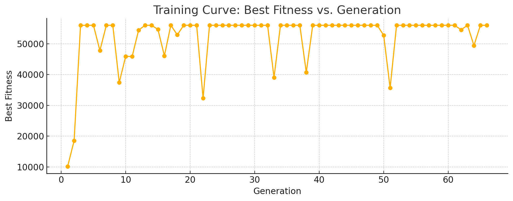

# LLM-Guided Evolutionary Flappy Bird - Evolutionary ICRL

**Project Abstract**

This project is an experiment in **evolutionary in-context reinforcement learning**. It demonstrates how a Large Language Model (LLM) can be used not only to generate and mutate policies, but also to guide the evolution of an agent's behavior in a simulated environment. The system evolves Flappy Bird-playing policies using a hybrid approach: traditional evolutionary algorithms are combined with LLM-guided mutations and policy generation. The LLM is prompted in-context with both successful and failed policies, enabling it to suggest creative, context-aware improvements that avoid known failure modes. This approach leverages the reasoning and generalization abilities of LLMs to accelerate and enrich the policy search process, resulting in more robust and effective agents than random evolution alone.

## Documentation

For a full technical specification, configuration details, and an in-depth explanation of the evolutionary in-context RL approach, see [`docs/manual.md`](docs/manual.md).

<!-- Example gameplay screenshot -->

## Features
- **Main Menu** with options:
  - Play Best Policy (if available)
  - Train Policy (Evolution)
  - Play Yourself
  - Quit
- **Interactive Play**: Play Flappy Bird using your keyboard (spacebar to flap).
- **AI Training**: Evolves policies using both random and LLM-guided mutations, with real-time training visualization and persistent best policy storage.
- **AI Playback**: Watch the best-trained policy play the game autonomously.
- **Robust Game Logic**: Consistent pipe gap randomization, collision detection, and unified gameplay for both human and AI.
- **LLM Integration**: Uses Ollama and a local instruction-following model (e.g., llama3:8b-instruct) for policy generation and mutation.

## How to Run

1. **Install Python 3.x** and required libraries:

    pip install -r requirements.txt

2. **Install and Run Ollama** (for LLM-guided evolution):
   - Download and install from https://ollama.com/
   - Pull a suitable model (e.g., llama3:8b-instruct):

        ollama pull llama3:8b-instruct

   - Start the Ollama server.
   - Set the `OLLAMA_ENDPOINT` and `OLLAMA_MODEL` in your `.env` file if needed (see `.env.example`).

3. **Start the Application**:

    python main.py

4. **Follow the on-screen menu** to play, train, or watch the AI.

## Project Structure
- `main.py`: All game, UI, AI, and training logic.
- `requirements.txt`: Python dependencies.
- `.env.example`: Example environment variables for LLM integration.
- `best_policy.json`: Stores the best evolved policy.
- `README.md`: This file.

## Technical Notes
- **Dependencies**: `pygame`, `requests`, `matplotlib`, `numpy`, `python-dotenv`.
- **LLM**: Requires a running Ollama server and a suitable model for JSON-based policy generation/mutation.
- **Training Visualization**: Real-time fitness curve and policy display during evolution.
- **Policy Storage**: Best policy is saved to `best_policy.json` and loaded for playback.

---

This project is ready for further experimentation, analytics, or gameplay polish!
